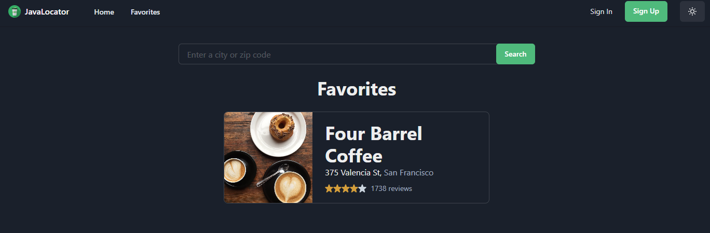
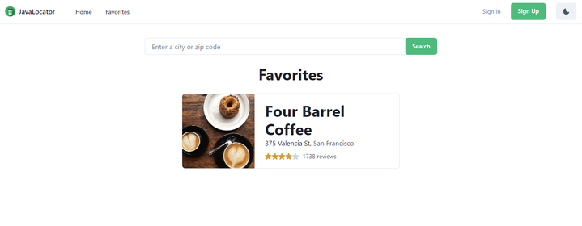

# JavaLocator
## Table of Contents 
 1. [Authors](#authors)
 2. [User Story](#user-story)
 3. [Description](#description)
 4. [Resources](#resources)
 5. [Visuals](#visuals)

## Authors
Safwan Islam

Alice Silva

Justin Stone

Jason Fox

## User Story

```
AS A coffee lover that moves around a lot, I want to be able to find coffee shops in the area with a click of a button
I WANT to be able to have access to the coffee shops ratings and location
SO THAT I can find new favorite places wherever I happen to be
```
## Description
We created a coffee site where the user can search coffee shops based on the yelp api query. This sends the user back coffee shops in the area allowing them access to the location, ratings, and website of the shop they are viewing. 

## Resources
[LIVE SITE](https://java-locator.herokuapp.com/)

[Github Repo](https://github.com/alicessilva22/Java-Locator)

## Visuals



